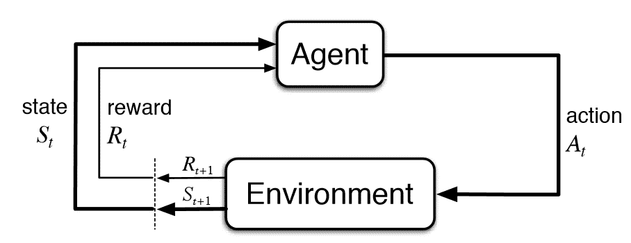
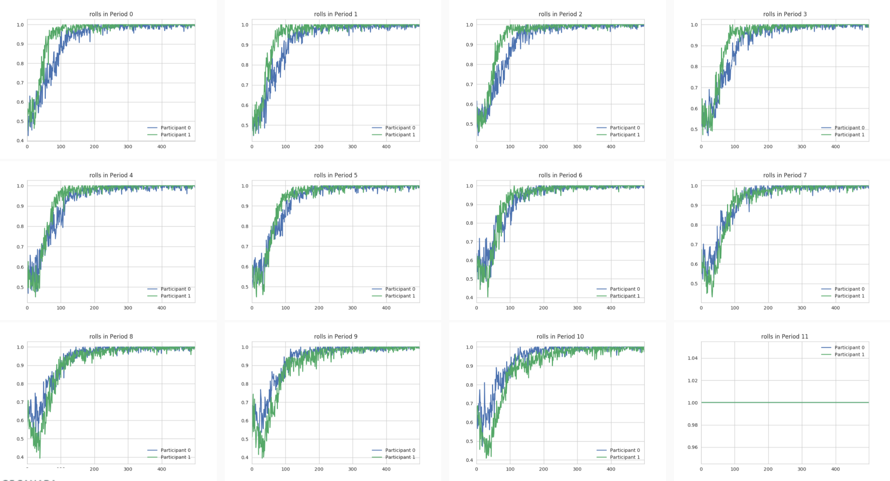
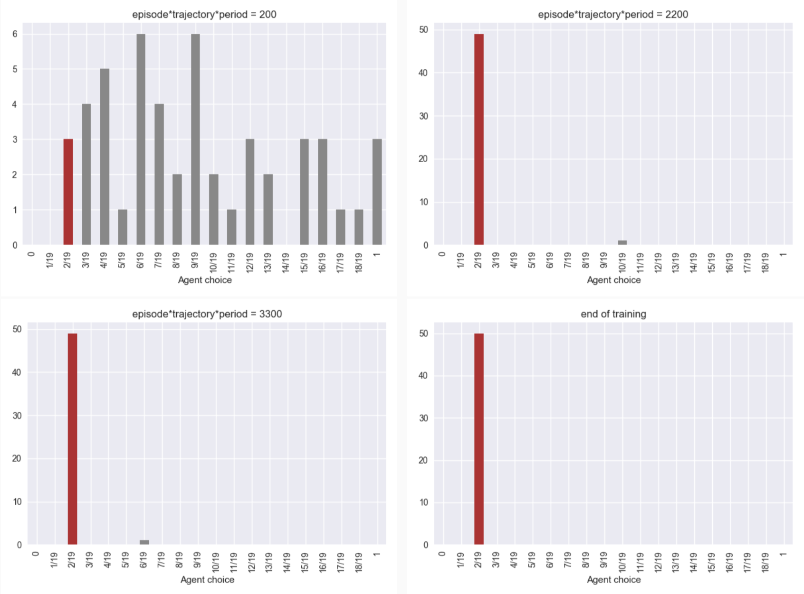
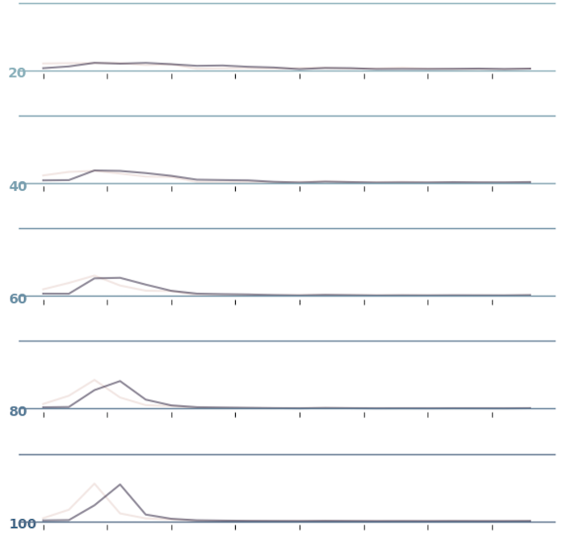
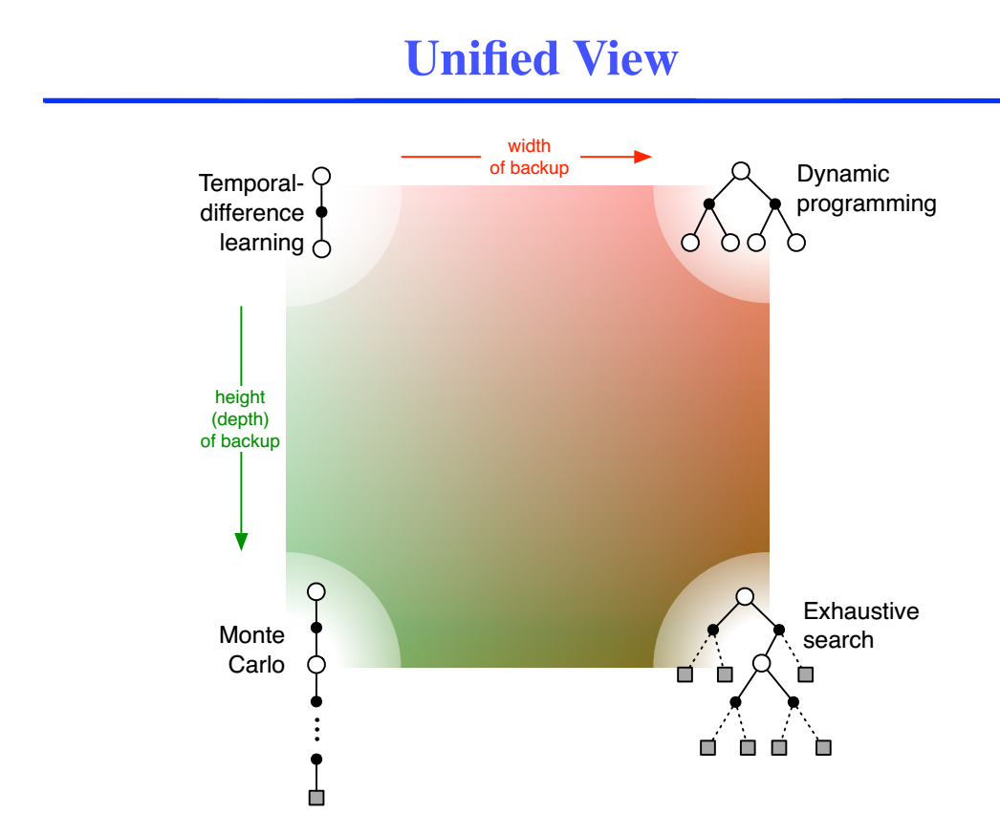
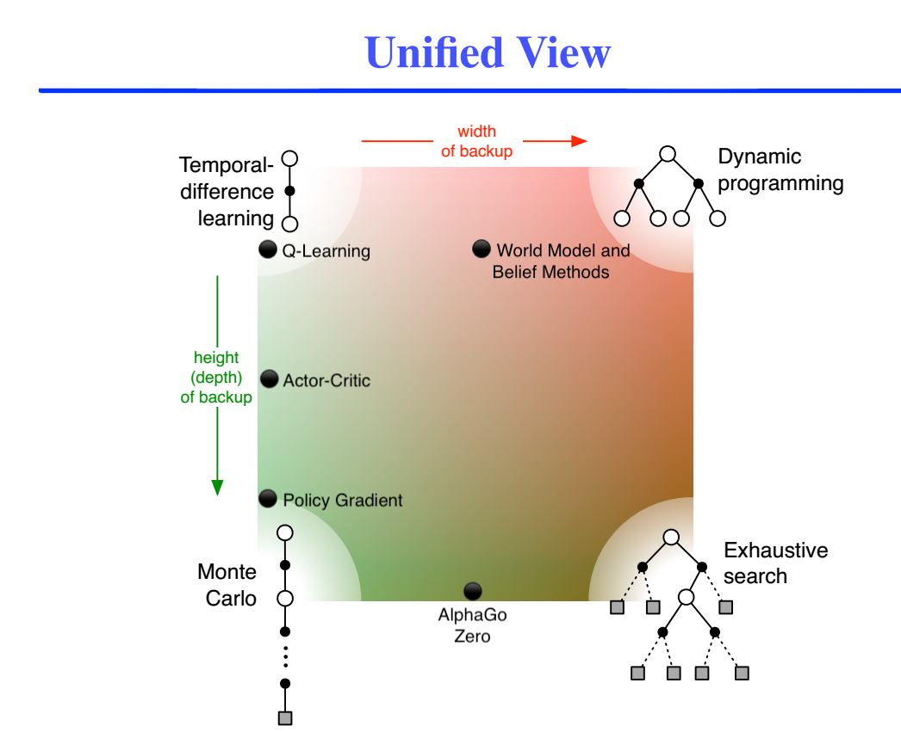

---
presentation:
  width: 800
  height: 1000
---

<!-- slide -->
## Reinforcement Learning Primer
#### Policy Gradient Methods

<!-- slide -->

### Agenda

0. Introduction to RL Framework
1. State Value Function Approximation Methods
2. State-Action Value Function Approximation Methods
3. Policy Function Approximation Methods
4. Deep Dive
5. Examples of Visualizing Learning

<!-- slide -->

### What is RL?



<!-- slide -->

### RL Framework

- An environment is formally described as a Markov Decision Process defined as a tuple $(S, A, P, R, \gamma)$
- Where $S$ is the space of all states
- $A$ is the space of all actions
- $P$ is the state transition probability function
- $R$ is a reward function
- $\gamma$ is the discount factor *

<!-- slide -->

### Why use RL?

- Control Theory: Dynamics must be known
- DP: Must have optimal substructure
- ABM: Hardcoded behaviour
- Evolutionary Algos: Poor convergence for dynamic and stochastic systems

<!-- slide -->

### Other Useful Definitions
- $\tau$, a trajectory, is loosely defined as a sequence of state-action-reward tuples $(s, a, r, s', ...)$
- $\pi$, a policy, is the behaviour of the agent defined as $\pi : S \rightarrow A$
- $V$, the state value function defined as $V: S \rightarrow R$
- $Q$, the action value function defined as $Q: S \times A \rightarrow R $

<!-- slide -->
### The Holy Grail
- We wish solve $\argmax_\pi \mathbb{E}_{\pi} [R(\tau) | s]$
- For many problems even verification of the optimal policy can be difficult, much less finding it
- In practice, RL is about the estimation of $\pi, V, Q$ which are theoretically equivalent methods, but with different practical considerations

<!-- slide -->
### State Value Function Approximation

- Here $\tau = (s_t, a_t, r_t, s_{t+1}, a_{t+1}, r_{t+1}, ...)$
- Methods that involve the estimation of V in the following form:
\[V_\pi(s) = \mathbb{E}_\pi [R(\tau)|S_t = s]\]
- Can't be used for many applications in RL
- $V_\pi(s) = \mathbb{E}_\pi [r_t + \gamma (r_{t+1} + V_\pi(s'))|s_t = s]$

<!-- slide -->
### State-Action (Q) Value Function Approximation

- Here $\tau = (s_t, a_t, r_t, s_{t+1}, a_{t+1}, r_{t+1}, ...)$
- Methods that involve the estimation of Q in the following form:
\[Q_\pi(s,a) = \mathbb{E}_\pi [R(\tau)|S_t = s, A_t = a]\]
- Note that $V_\pi(s) = \max_{a}Q_\pi(s,a)$

<!-- slide -->
### Policy Function Approximation
- In the previous examples, the policy $\pi$ can be derived
- Idea: why not just learn $\pi$ directly?
- $\pi(s) = \argmax_{a}\mathbb{E}_{\tau \sim \pi}[R(\tau)| s]$
- $\pi(s) \equiv P(a | s, \theta)$

<!-- slide -->
### Implementation
- Many choices of cost functions, typically: \[J(\theta) = \mathbb{E}_{\tau \sim p(\tau;\theta)}[R(\tau)]\]
- Proceed to use gradient descent:
\[
\nabla_{\theta}J(\theta) \approx \mathbb{E}_{\tau \sim p(\tau;\theta)} [\sum_{t \geq 0}r(\tau)\nabla_\theta\log\pi_\theta(a_t|s_t)]
\]

Gradient Update:
\[
\theta \leftarrow \theta + \alpha \nabla_{\theta}J(\theta)
\]

<!-- slide -->
### MCPG Pseudocode
```
1. Start with random weights W, trajectory queue T
2. For each episode:
3.  For each trajectory:
4.   For each time-step:
5.    Record state
6.    Sample and perform action given from the policy
7.    Record reward signal from environment
8.  Perform gradient update to W using T
```

<!-- slide -->
### Example Problem Setup

- Environment is the payment simulator
- Actions are the amount of collateral that you post, and the choice of payments throughout the day
- State is the current liquidity position, payment demands, choice of initial liquidity, time of day

<!-- slide -->
### Two sub problems for empirical verification

1. Given an infinite amount of initial liquidity, can agent learn to send all payments
2. Given that agent sends all payments, can agent learn the optimal initial liquidity
<!-- slide -->
### Recent Results


<!-- slide -->
### Recent Results


<!-- slide -->
### Recent Results


<!-- slide -->


<!-- slide -->


<!-- slide -->
### Appendix

\[
\nabla_{\theta}p(\tau;\theta) = p(\tau;\theta)\frac{\nabla_{\theta}p(\tau;\theta)}{p(\tau;\theta)} = \nabla_{\theta}\log{p(\tau;\theta)}p(\tau;\theta)
\]

\[
\nabla_{\theta}J(\theta) = \int_{\tau}r(\tau)\nabla_{\theta}\log{p(\tau;\theta)}p(\tau;\theta)d\tau
\]

\[
\nabla_{\theta}J(\theta) =
\mathbb{E}_{\tau \sim p(\tau;\theta)}[\sum_{t \geq 0}r(\tau)\nabla_{\theta}\log{p(\tau;\theta)}]
\]
